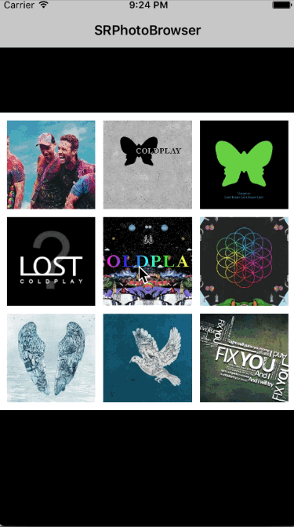

# SRPictureBrowser

### A concise and elegant easy-to-use picture browser.

## Show pictures

    


## Usage

````objc
UIImageView *tapedImageView = (UIImageView *)tapGestureRecognizer.view;
NSMutableArray *imageBrowserModels = [[NSMutableArray alloc] init];
for (NSInteger i = 0; i < 9; i ++) {
    SRPictureModel *imageBrowserModel = [SRPictureModel sr_pictureModelWithPicURLString:self.picURLStrings[i]
                                                                          containerView:tapedImageView.superview
                                                                    positionInContainer:[self.imageViewFrames[i] CGRectValue]
                                                                                  index:i];
    [imageBrowserModels addObject:imageBrowserModel];
}
SRPictureBrowser *pictureBrowser = [SRPictureBrowser sr_pictureBrowserWithModels:imageBrowserModels currentIndex:tapedImageView.tag];
[pictureBrowser show];

// You can see the demo for more information.
````

**If you have any question, please issue or contact me.**   
**If this repo helps you, please give it a star, thanks a lot.**  
**Have Fun.**