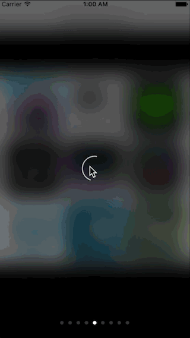

# SRPictureBrowser

A concise and elegant easy-to-use picture browser.

## Features

* Loading image with animation.
* blurring the current view background.
* Long press the image to show action sheet.

## Screenshots




## Installation

### CocoaPods
> Add **pod 'SRPictureBrowser'** to the Podfile, then run **pod install** in the terminal.

### Manual
> Drag the **SRPictureBrowser** folder to the project.(Note: if the project has already import SDWebImage, you should remove it which in the SRPictureBrowser folder)

## Usage

````objc
/**
 Displays a SRPictureBrowser object with pictureModels, currentIndex and delegate.

 @param pictureModels The models which contains SRPictureModel.
 @param currentIndex  The index of model which will show firstly.
 @param delegate      The delegate of this object.
 */
+ (void)sr_showPictureBrowserWithModels:(NSArray *)pictureModels currentIndex:(NSInteger)currentIndex delegate:(id<SRPictureBrowserDelegate>)delegate;

/**
 Creates and returns a model of picture information.

 @param picURLString        The URL string of the picture.
 @param containerView       The super view of the picture view.
 @param positionInContainer The picture view's position in its super view.
 @param index               The index of this picture in all pictures.
 @return A SRPictureModel object.
 */
+ (instancetype)sr_pictureModelWithPicURLString:(NSString *)picURLString
                                  containerView:(UIView *)containerView
                            positionInContainer:(CGRect)positionInContainer
                                          index:(NSInteger)index;
````

````objc
UIImageView *tapedImageView = (UIImageView *)tapGestureRecognizer.view;
NSMutableArray *imageBrowserModels = [[NSMutableArray alloc] init];
for (NSInteger i = 0; i < 9; i ++) {
    SRPictureModel *imageBrowserModel = [SRPictureModel sr_pictureModelWithPicURLString:self.picURLStrings[i]
                                                                          containerView:tapedImageView.superview
                                                                    positionInContainer:[self.imageViewFrames[i] CGRectValue]
                                                                                  index:i];
    [imageBrowserModels addObject:imageBrowserModel];
}
[SRPictureBrowser sr_showPictureBrowserWithModels:imageBrowserModels currentIndex:tapedImageView.tag delegate:self];
````

See the demo for more contents.  